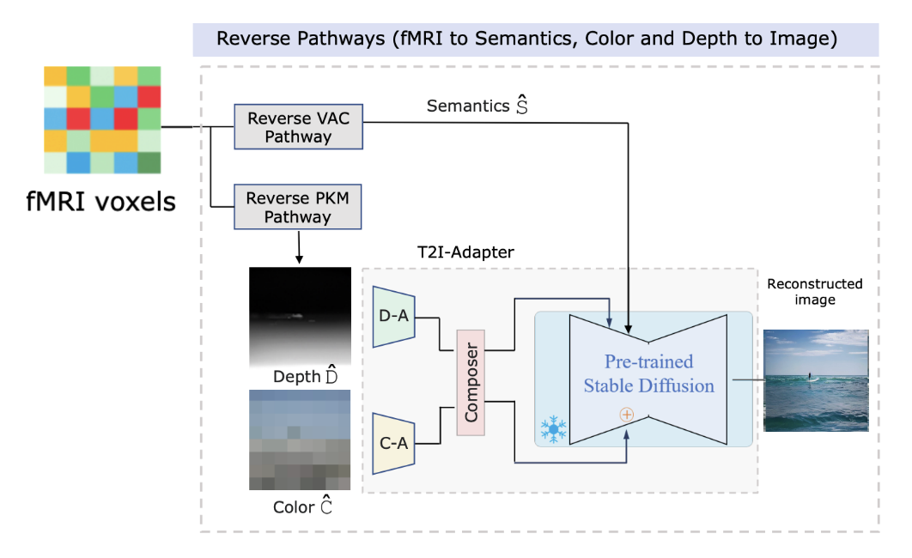

<div align="center">
  <h1>Reproduction of the results produced by "DREAM" Reasearch Paper</h1>
  <div>
    <a href="https://github.com/silveradium" target="_blank">Agra Navaratne</a><sup>1</sup> &emsp;
    <a href="https://github.com/RivikulaFernando" target="_blank">Rivikula Fernando</a><sup>1</sup>
  </div>
  <div>
    <sup>1</sup>Department of Electronic and Telecommunication Engineering, University of Moratuwa, Sri Lanka
  </div>
  <div>
    Under the supervision of <a href="https://www.linkedin.com/in/venuri-amarasinghe" target="_blank">Venuri Amarasinghe</a> and <a href="https://www.linkedin.com/in/rangarodrigo" target="_blank">Ranga Rodrigo</a>
  </div>
</div>

---
</div>

>**Abstract:** In this work we introduce DREAM: Visual Decoding from REversing HumAn Visual SysteM. DREAM represents an fMRI-to-image method designed to  reconstruct visual stimuli based on brain activities, grounded on fundamental knowledge of the human visual system (HVS). By crafting reverse pathways, we emulate the hierarchical and parallel structures through which humans perceive visuals. These specific pathways are optimized to decode semantics, color, and depth cues from fMRI data, mirroring the forward pathways from the visual stimuli to fMRI recordings. To achieve this, we have implemented two components that mimic the reverse processes of the HVS.  The first, the Reverse Visual Association Cortex (R-VAC, Semantics Decipher), retraces the pathways of this particular brain region, extracting semantics directly from fMRI data. The second, the Reverse Parallel PKM (R-PKM, Depth & Color Decipher), predicts both color and depth cues from fMRI data concurrently. The Guided Image Reconstruction (GIR) is responsible for reconstructing final images from deciphered semantics, color, and depth cues by using the Color Adapter (C-A) and the Depth Adapter (D-A) in T2I-Adapter in conjunction with Stable Diffusion (SD).

<div>

<div align="center">
  
</div>

## 📌 Project Overview 

This repository contains a reproduction of the **DREAM: Visual Decoding from REversing HumAn Visual SysteM** project, originally presented in the paper by Xia et al. (WACV 2024). The work was carried out as an academic assignment at the University of Moratuwa under the supervision of Venuri Amarasinghe and Ranga Rodrigo.

**DREAM** is an fMRI-to-image method designed to reconstruct visual stimuli from brain activity, leveraging principles of the human visual system (HVS). By modeling reverse pathways, it decodes semantics, color, and depth cues from fMRI data, reconstructing images using Stable Diffusion and T2I-Adapter.

### Current Status
- **R-PKM (Depth & Color Decipher)**: ✅ Fully replicated. Uses MiDaS for depth reconstruction, uses vdvae pretrained model for latent feature extraction where fmri data is trained across latent features using ridge regression.
- **R-VAC (Semantics Decipher)**: 🟡 Partially implemented, currently using Versatile Diffusion as the image generator instead of the full DREAM pipeline. Fmri data is converted to CLIP Text and CLIP Vision using a pretrained versatile diffusion model.
- **Final Reconstruction**: 🟡 Functional, using Stable Diffusion with T2I-Adapter for depth-guided and text-prompt-based image reconstruction.
- ⚠️ This is a work in progress, with known inconsistencies in R-VAC inference that will be addressed in future updates.

---

## 🧠 Methodology

The DREAM reproduction simplifies the original pipeline into a single, Colab-oriented workflow, integrating the following components:

1. **Reverse PKM (R-PKM)**: Predicts depth and color cues from fMRI data, mimicking the reverse processes of the HVS.
2. **Reverse Visual Association Cortex (R-VAC)**: Extracts semantics from fMRI data (partially implemented using Versatile Diffusion).
3. **Guided Image Reconstruction (GIR)**: Reconstructs images using Stable Diffusion with T2I-Adapter’s Color Adapter (C-A) and Depth Adapter (D-A).

The pipeline uses the **Natural Scenes Dataset (NSD)** for training and testing, with depth maps generated via **MiDaS** as surrogate ground truth.

<div align="center">
  
</div>

---

## 🪐 Getting Started

### Prerequisites
- **Hardware Requirements**:
  - **Disk Space**: ≥ 15 GB (for Subject 1 NSD data + pretrained models)
  - **System RAM**: ≥ 50 GB
  - **GPU**: ≥ 15 GB VRAM (e.g., NVIDIA T4 GPU with High RAM in Colab)
- **Software Dependencies**: Listed in `main.ipynb` or install manually via:
  ```bash
  pip install -r requirements.txt
  ```
  Ensure dependencies for Stable Diffusion, T2I-Adapter, and MiDaS are installed (see notebooks for details).

### Installation
1. Clone the repository:
   ```bash
   git clone https://github.com/your-username/your-repo-name.git
   cd your-repo-name
   ```
2. Open `main.ipynb` in Google Colab or a local Jupyter environment.
   - For local setups, adjust relative paths manually and install dependencies as shown in the notebook.

### Running the Pipeline
The `main.ipynb` notebook includes the full workflow:
1. **Setup**: Downloads Subject 1's NSD data.
2. **Preprocessing**: Converts images to `.npy` format, organizes data, and generates depth maps using MiDaS.
3. **R-PKM**: Loads pretrained models and runs inference for depth and color decoding.
4. **R-VAC**: Partially implemented semantics decoding using Versatile Diffusion.
5. **Stable Diffusion Reconstruction**: Uses T2I-Adapter with depth guidance and text prompts (see `stablediffusion.ipynb`).

**Note**: By default, training uses the first 300 images. Modify the preprocessing section in `main.ipynb` to include more images.

### Additional Scripts
- `stablediffusion.ipynb`: Runs Stable Diffusion with T2I-Adapter for depth-guided image reconstruction.
- `preprocessing.py` (optional): Converts NSD images to `.npy` and generates depth maps.
- `train_rpkm.py` (optional): Example training loop for R-PKM.

---

## 📂 Data Acquisition
- **Dataset**: [Natural Scenes Dataset (NSD)](https://huggingface.co/datasets/pscotti/naturalscenesdataset/tree/main)
  - Only Subject 1 data is used in this reproduction.
- **Depth Maps**: Generated using MiDaS as surrogate ground truth.
- **Data Organization**: Automatically structured into appropriate folders during preprocessing in `main.ipynb`.

---

## 🧰 Repository Structure
| File/Script | Description |
|-------------|-------------|
| `main.ipynb` | Full pipeline for setup, preprocessing, R-PKM, and partial R-VAC inference. |
| `stablediffusion.ipynb` | Runs Stable Diffusion with T2I-Adapter for depth-guided reconstruction. |
| `preprocessing.py` | Converts NSD images to `.npy` and generates depth maps (optional). |
| `train_rpkm.py` | Example training loop for R-PKM (optional). |
| `docs/images/` | Contains project images, including `method_overview.png`. |

---

## 🧪 References & Upstream Projects
This reproduction relies on the following methods, datasets, and codebases:
- **DREAM Original Repository**: [weihaox/DREAM](https://github.com/weihaox/DREAM)
- **Natural Scenes Dataset**: [naturalscenesdataset.org](https://naturalscenesdataset.org/)
- **VDVAE**: [openai/vdvae](https://github.com/openai/vdvae)
- **Brain-Diffuser**: [ozcelikfu/brain-diffuser](https://github.com/ozcelikfu/brain-diffuser)
- **MindEye**: [MedARC-AI/fMRI-reconstruction-NSD](https://github.com/MedARC-AI/fMRI-reconstruction-NSD)
- **MindEyeV2**: [MedARC-AI/MindEyeV2](https://github.com/MedARC-AI/MindEyeV2)
- **Stable Diffusion**: [Hugging Face](https://huggingface.co/stabilityai/stable-diffusion-xl-base-1.0)
- **T2I-Adapter**: [TencentARC/T2I-Adapter](https://github.com/TencentARC/T2I-Adapter)
- **Versatile Diffusion**: [shi-labs/versatile-diffusion](https://huggingface.co/shi-labs/versatile-diffusion/resolve/main/pretrained_pth/)
- **MiDaS**: [isl-org/MiDaS](https://github.com/isl-org/MiDaS)

---

## 🧾 Citation
If citing the original DREAM work, please use:
```bibtex
@inproceedings{xia2023dream,
  author    = {Xia, Weihao and de Charette, Raoul and Öztireli, Cengiz and Xue, Jing-Hao},
  title     = {DREAM: Visual Decoding from Reversing Human Visual System},
  booktitle = {Proceedings of the IEEE/CVF Winter Conference on Applications of Computer Vision (WACV)},
  year      = {2024},
}
```

For this reproduction, please credit:
> Agra Navaratne & Rivikula Fernando, University of Moratuwa  
> Under the supervision of Venuri Amarasinghe and Ranga Rodrigo

---

## 🧭 Future Work
- Complete the R-VAC pipeline for full semantics decoding.
- Integrate the original DREAM text-embedding pipeline.
- Improve inference consistency and reconstruction fidelity.
- Extend training to include more than 300 images for robust results.

---

## 📬 Contact
For issues or discussions, please:
- Open an [Issue](https://github.com/your-username/your-repo-name/issues) on this repository.
- Contact the contributors:
  - 👤 **Agra Navaratne**: [silveradium](https://github.com/silveradium) | [LinkedIn](https://linkedin.com/in/agra-navaratne) | [Email](mailto:agranavaratne@gmail.com)
  - 👤 **Rivikula Fernando**: [RivikulaFernando](https://github.com/RivikulaFernando) | [LinkedIn](https://linkedin.com/in/rivikulaf)

---

## ✅ Disclaimer
This project is for **academic research and learning purposes only** and is not affiliated with the original DREAM authors.

---

<div align="center">
  <p>© 2025 Agra Navaratne & Rivikula Fernando</p>
</div>
